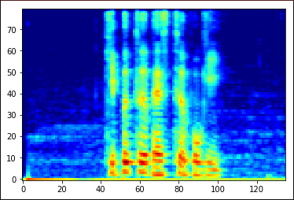
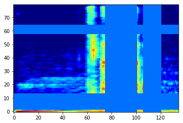

# SpecAugment with numpy & scipy

This is SpecAugment code with numpy and scipy.

In my test environment, this code is about 100 time faster than using tensorflow.

## Usage
```
pip install -r requirements.txt
python3 specaugment.py
```

if you want to test your test audio, run this command
```
python3 specaugment.py -i <input file>
```

## Example output

```
start to SpecAugment 100 times
whole processing time : 0.9117 second
average processing time : 9.12 ms
```

- original spectrogram




- warped spectrum


- warped + masked spectrum




## Reference

1. https://arxiv.org/pdf/1904.08779.pdf
